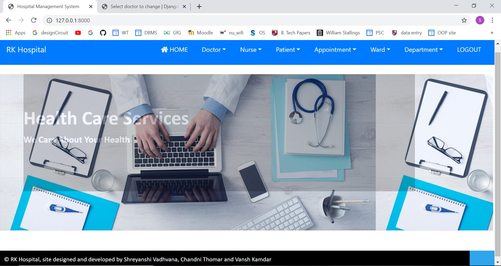
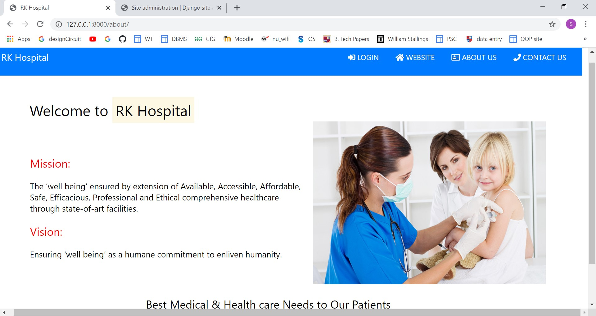
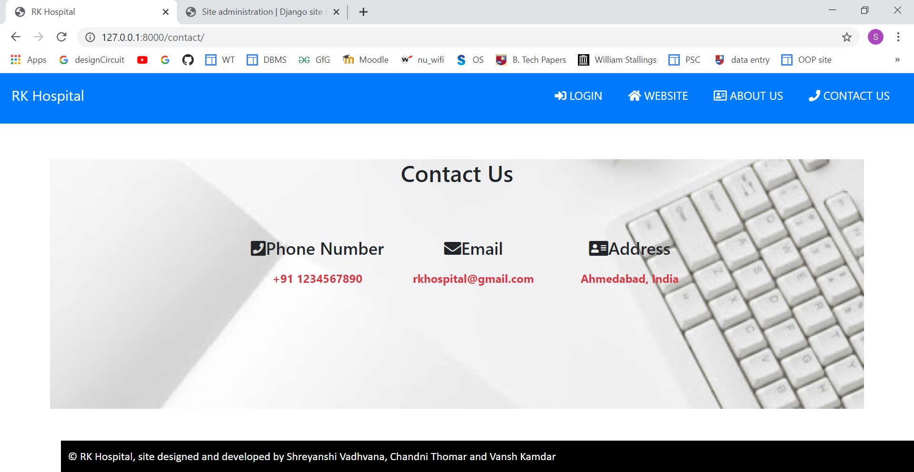
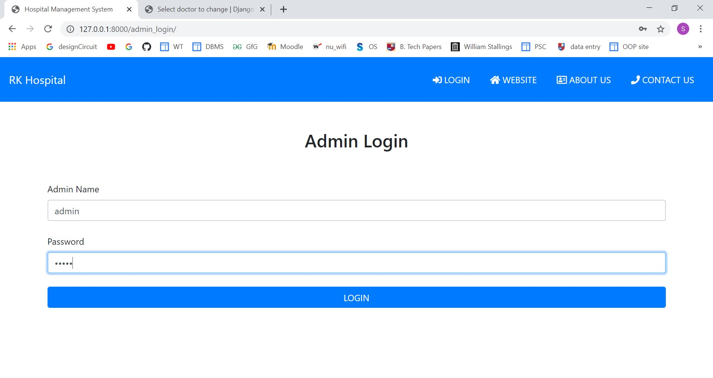
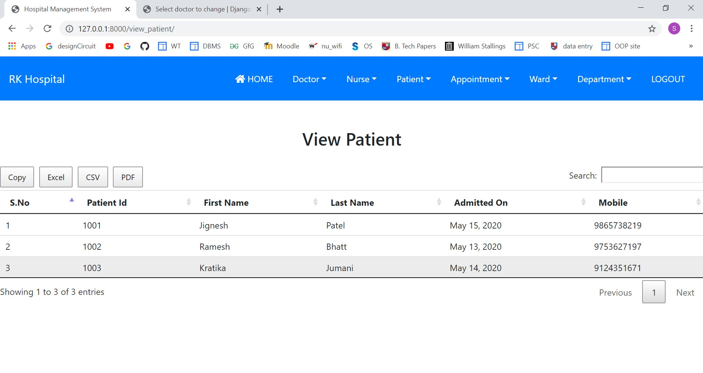
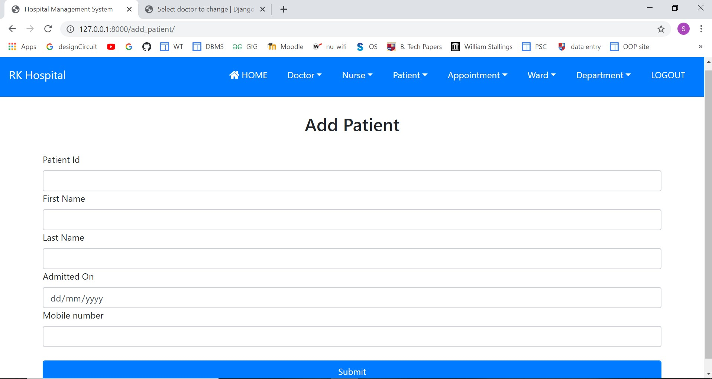
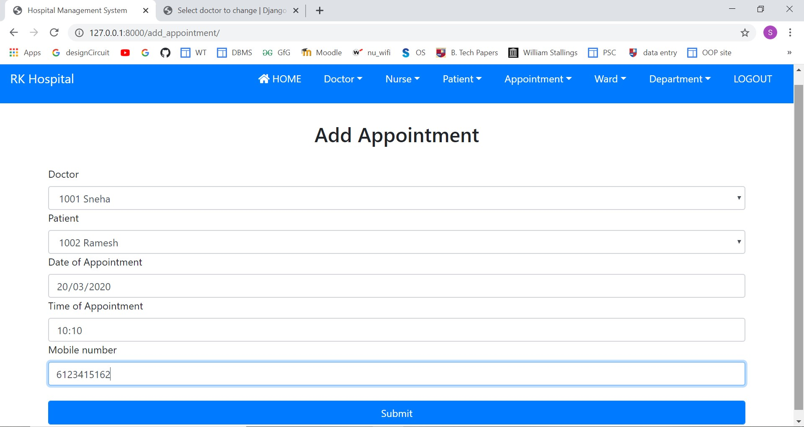
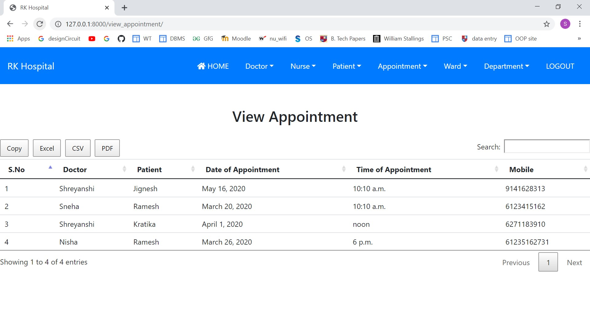

## Hospital-Management-System

<h4>ABOUT THE PROJECT:</h4>
<ol>
  <li>It is a web based application that helps in proper functioning of the hospital without the use of any paper.</li>
  <li>Maintains the medical records, contact details of the patient.</li>
  <li>We can search and filter the details according to our requirements.</li>
  <li>Can generate CSV file, PDF file and Excel Sheet.<li>
  <li>Maintains the details and appointment of the doctors.</li>
  <li>Technologies Used: Django, HTML, CSS, Bootstrap.</li>
</ol>

<h5>Main Page</h5>

</img>

<h5>About Us Page</h5>

</img>

<h5>Contact Us Page</h5>

</img>

<h5>Login Page</h5>

</img>

<h5>Details Of Patient</h5>

</img>

<h5>Adding Patient</h5>

</img>

<h5>Getting Appointment</h5>

</img>

<h5>Viewing Appointment</h5>

</img>

